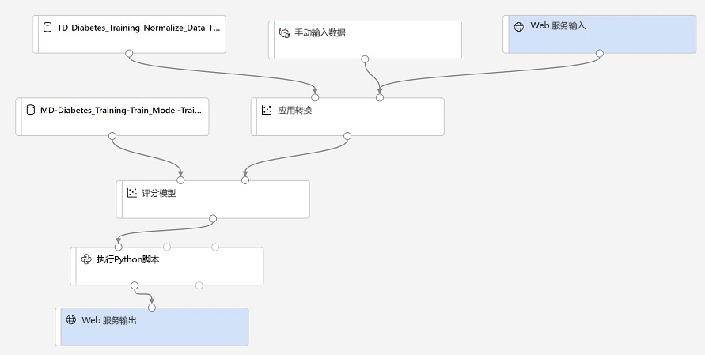

---
lab:
    title: '使用 Azure 机器学习设计器'
---
# 使用 Azure 机器学习设计器

Azure 机器学习*设计*器提供了拖放环境，你可以在其中定义工作流或数据引入的*管道*、转换以及模型训练模块，以创建机器学习模型。然后，可以将该管道以 Web 服务的形式发布，以便客户端应用程序可以使用该管道*进行推理* （根据新数据生成预测）。

## 准备工作

如果尚未完成 *[创建 Azure 机器学习工作区](01-create-a-workspace.md)* 练习以创建 Azure 机器学习工作区和计算实例，请完成它，并克隆本练习所需的笔记本。

## 配置计算资源

若要使用 Azure 机器学习设计器，需要在其上运行模型训练试验的计算。

1. 使用与 Azure 订阅关联的 Microsoft 凭据登录到 [Azure 机器学习工作室](https://ml.azure.com?azure-portal=true)，然后选择你的 Azure 机器学习工作区。
2. 在 Azure 机器学习工作室中，查看 **“计算”** 页面，然后在 **“计算实例”** 选项卡上，启动计算实例（如果尚未运行）。你将使用此计算实例来测试经过训练的模型。
3. 在计算实例启动时，切换到 **“计算群集”** 选项卡。如果还没有现有的计算群集，请使用以下设置添加一个新的计算群集。你将使用此群集来运行训练管道。
    - **区域**： *与工作区相同的区域*
    - **虚拟机优先级**： 专用
    - **虚拟机类型**： CPU
    - **虚拟机大小**： Standard_DS11_v2
    - **计算名称**： *输入唯一名称*
    - **节点数下限**： 0
    - **节点数上限**： 2
    - **缩减之前的空闲秒数**： 120
    - **启用 SSH 访问**： 未选择

## 查看正在训练的数据集

现在有了一些可用于运行训练管道的计算资源，你将需要一些数据来训练模型。

1. 在 Azure 机器学习工作室中，查看 **“数据集”** 页面。数据集表示你计划在 Azure ML 中使用的特定数据文件或表。
2. 如果以前创建了 **“糖尿病数据集”** 数据集，请将其打开；否则，使用以下设置从 Web 文件创建新的数据集，然后将其打开：
    * **基本信息**：
        * **Web URL**： https://aka.ms/diabetes-data
        * **名称**： 糖尿病数据集
        * **数据集类型**： 表格
        * **描述**： 糖尿病数据
    * **设置和预览**：
        * **文件格式**： 带分隔符
        * **分隔符**： 逗号
        * **编码**： UTF-8
        * **列标题**： 使用第一个文件的标题
        * **跳过行**： 无
    * **架构**：
        * 包括除 **“路径”** 之外的所有列
        * 查看自动检测的类型
    * **确认详细信息**：
        * 创建数据集后，请勿对其进行分析

4. 查看 **“浏览”** 页面以查看数据样本。此数据表示已接受糖尿病测试的患者的详细信息，你将使用它来训练一个模型，该模型可根据临床测量值预测患者糖尿病测试呈阳性的可能性。

## 创建设计器管道

要开始使用设计器，首先必须创建管道并添加要使用的数据集。

1. 在 Azure 机器学习工作室中，查看 **“设计器”** 页面并创建新管道。
2. 在 **“设置”** 窗格中，将默认管道名称 (**Pipeline-Created-on-date**) 更改为 **“视觉对象糖尿病训练”** （如果 **“设置”** 窗格不可见，请单击顶部管道名称旁边的 **“&#9881;”** 图标）。
3. 请注意，需要指定要在其上运行管道的计算目标。在 **“设置”** 窗格中，单击 **“选择计算目标”** 并选择你的计算群集。
4. 在设计器的左侧，展开 **“数据集”** 部分，然后将 **“糖尿病数据集”** 数据集拖动到画布上。
5. 选择画布上的 **“糖尿病数据集”** 模块。然后右键单击它，并在 **“可视化”** 菜单上选择 **“数据集输出”**。
6. 查看数据的架构，请注意，可采用直方图的形式查看各列的分布情况。然后关闭可视化效果。

## 添加转换

通常需要先对数据应用某些预处理转换，然后才能训练模型。

1. 在左侧窗格中，展开 **“数据转换”** 部分，其中包含各种模块，可用于在训练模型之前转换数据。
2. 将 **“规范化数据”** 模块拖到 **“糖尿病数据集”** 模块下方的画布上。然后将 **“糖尿病数据集”** 模块的输出连接到 **“规范化数据”** 模块的输入。
3. 选择 **“规范化数据”** 模块并查看其设置，注意它要求指定转换方法和要转换的列。然后，将转换保留为 **“ZScore”**，编辑各列，使其包含以下列名称：
    * PlasmaGlucose
    * DiastolicBloodPressure
    * TricepsThickness
    * SerumInsulin
    * BMI
    * DiabetesPedigree

    **备注**： 我们将对数值列进行规范化，使其具有相同的量级，并避免具有较大值的列主导模型训练。通常要进行很多次这样的预处理转换来准备用于训练的数据，但是在本练习中，我们一切从简。

4. 现在，我们可以将数据拆分到多个单独的数据集中，以进行训练和验证。在左侧窗格中，在 **“数据转换”** 部分，将 **“拆分数据”** 模块拖到 **“规范化数据”** 模块下方的画布上。然后将 **“规范化数据”** 模块的 **“转换的数据集”** （左侧）输出连接到 **“拆分数据”** 模块的输入。
5. 选择 **“拆分数据”** 模块，并将其设置配置如下：
    * **拆分模式**： 拆分行
    * **第一个输出数据集中的行的占比**： 0.7
    * **随机种子**： 123
    * **分层拆分**： False

## 添加模型训练模块

准备好数据并将其拆分为训练数据集和验证数据集后，即可配置管道来训练和评估模型。

1. 在左侧窗格中展开 **“模型训练”** 部分，然后将 **“训练模型”** 模块拖到 **“拆分数据”** 模块下方的画布上。然后，将 **“拆分数据”** 模块的 **“结果数据集 1”** （左侧）输出连接到 **“训练模型”** 模块的 **“数据集”** （右侧）输入。
2. 我们正在训练的模型将预测 **“糖尿病”** 值，因此选择 **“训练模型”** 模块并修改其设置，将 **“标签列”** 设置为 **“Diabetic”** （匹配大小写并准确拼写！）
3. 该模型将预测的 **“Diabetic”** 标签是一个二元列（对于有糖尿病的患者，值为 1；对于没有糖尿病的患者，值为 0），因此我们需要使用**分类**算法来训练模型。展开 **“机器学习算法”** 部分，然后在 **“分类”** 下，将 **“二元逻辑回归”** 模块拖到 **“拆分数据”** 模块左侧、 **“训练模型”** 模块上方的画布上。然后将此模块输出连接到 **“训练模型”** 模块的 **“未训练模型”** （左侧）输入。
4. 为了测试经过训练的模型，我们需要使用它来对拆分原始数据时保留的验证数据集进行评分。展开 **“模型评分和评估”** 部分，并将 **“对模型进行评分”** 模块拖到 **“训练模型”** 模块下方的画布上。然后将 **“训练模型”** 模块的输出连接到 **“对模型进行评分”** 模块的 **“已训练模型”** （左侧）输入，并将 **“拆分数据”** 模块的 **“结果数据集 2”** （右侧）输出拖到 **“对模型进行评分”** 模块的 **“数据集”**（右侧）输入。
5. 为了评估模型的性能，我们需要查看对验证数据集进行评分时生成的一些指标。从 **“模型评分和评估”** 部分，将 **“评估模型”** 模块拖到 **“对模型进行评分”** 模块下的画布上，然后将 **“对模型进行评分”** 模块的输出连接到 **“评估模型”** 模块的 **“对数据集进行评分”** （左侧）输入。

## 运行训练管道

定义数据流步骤后，现在可以运行训练管道并训练模型。

1. 验证管道外观是否与以下类似：

    

2. 单击右上角的 **“提交”**。然后在系统出现提示时，创建一个名为 **mslearn-designer-train-diabetes** 的新试验，并运行该试验。 这将初始化计算群集，然后运行管道，这可能需要 10 分钟或更长的时间才能完成。可以在设计画布的右上方看到管道运行的状态。

    > **提示**： 如果发生 **GraphDatasetNotFound** 错误，请选择数据集，然后在其“属性”窗格中更改 **“版本”** （可在“始终使用最新”和“1”之间进行切换），接着重新运行管道。
    >
    > 在运行过程中，可以在 **“管道”** 和 **“试验”** 页面查看已创建的管道和试验。完成后，切换回 **“设计器”** 页面上的 **“视觉对象糖尿病训练”** 管道。

3. **“规范化数据”** 模块完成后，选择它，然后在 **“设置”** 窗格中的 **“输出 + 日志”** 选项卡上，在 **“转换数据集”** 部分的 **“数据输出”** 下，单击 **“可视化”** 图标，并注意你可以查看转换列的统计信息和分布可视化效果。
4. 关闭 **“规范化数据”** 可视化效果并等待其余模块完成。然后可视化 **“评估模型”** 模块的输出，以查看模型的性能指标。

    **备注**： 此模型的性能不是很好，部分原因是我们仅执行了最少的特征工程和预处理。可以尝试其他分类算法并比较结果（可以将 **“拆分数据”** 模块的输出连接到多个 **“训练模型”** 和 **“对模型进行评分”** 模块，还可以将第二个评分模型连接到 **“评估模型”** 模块以便并行比较）。练习的目的只是为了向你介绍设计器界面，而不是训练完美的模型！

## 创建推理管道

使用*训练管道*来训练模型后，就可以创建一个*推理管道*，该推理管道使用经过训练的模型来预测新数据的标签。

1. 在 **“创建推理管道”** 下拉列表中，单击 **“实时推理管道”**。几秒钟后，将打开新版本的管道，名为 **“视觉对象糖尿病训练-实时推理”**。
2. 将新管道重命名为 **“预测糖尿病”**，然后检查新管道。请注意，标准化转换和经过训练的模型已封装在此管道中，因此训练数据中的统计信息将用于规范化任何新数据值，并且经过训练的模型将用于对新数据进行评分。
3. 请注意，推理管道会假设新数据将与原始训练数据的架构匹配，因此将训练管道中的 **“糖尿病数据集”** 数据集包括在内。但是，此输入数据包括模型预测的 **“Diabetic”** 标签，位于尚未进行糖尿病预测的新患者数据而言，这样并不直观。
4. 将此 **“糖尿病数据集”** 数据集从推理管道中删除，并在 **“数据输入和输出”** 部分中将其替换为 **“手动输入数据”** 模块，将该模块连接到与 **“Web 服务输入”** 相同的 **“应用转换”** 模块的 **“数据集”** 输入。然后，修改 **“手动输入数据”** 模块的设置以使用以下 CSV 输入，其中包括对三位新患者观察得出的不带标签的特征值：

```CSV
PatientID,Pregnancies,PlasmaGlucose,DiastolicBloodPressure,TricepsThickness,SerumInsulin,BMI,DiabetesPedigree,Age
1882185,9,104,51,7,24,27.36983156,1.350472047,43
1662484,6,73,61,35,24,18.74367404,1.074147566,75
1228510,4,115,50,29,243,34.69215364,0.741159926,59
```

5. 推理管道包括 **“评估模型”** 模块，此模块在根据新数据进行预测时无用，因此请删除此模块。
6. **“对模型进行评分”** 模块的输出包括所有输入功能以及预测标签和概率得分。要将输出限制为仅预测和概率，请删除 **“对模型进行评分”** 模块和 **“Web 服务输出”** 之间的连接，在 **“Python 语言”** 部分添加一个 **“执行 Python 脚本”** 模块，将 **“对模型进行评分”** 模块的输出连接到 **“执行 Python 脚本”** 的 **“数据集 1”** （最左边）输入，然后将 **“执行 Python 脚本”** 模块的输出连接到 **“Web 服务输出”**。然后，修改 **“执行 Python 脚本”** 模块的设置，以使用以下代码（替换所有现有代码）：

```Python
import pandas as pd

def azureml_main(dataframe1 = None, dataframe2 = None):

    scored_results = dataframe1[['PatientID', 'Scored Labels', 'Scored Probabilities']]
    scored_results.rename(columns={'Scored Labels':'DiabetesPrediction',
                                    'Scored Probabilities':'Probability'},
                            inplace=True)
    return scored_results
```

7. 确认管道如下所示：

    

9. 将管道作为名为 **“mslearn-designer-predict-diabetes”** 的新试验提交到用于训练的计算群集上。这可能需要一点时间。

## 将推理管道部署为 Web 服务

现在有了用于实时推理的推理管道，可以将其部署为 Web 服务，以供客户端应用程序使用。

> **备注**： 在本练习中，你将把 Web 服务部署到 Azure 容器实例 (ACI)。这种类型的计算是动态创建的，对于开发和测试很有用。对于生产环境，应创建一个*推理群集*，该推理群集可提供 Azure Kubernetes 服务 (AKS) 群集，从而提供更好的可伸缩性和安全性。

1. 如果**预测**糖尿病推理管道尚未完成运行，请等待其完成。然后将 **“执行 Python 脚本”** 模块的 **“结果数据集”** 输出可视化，以查看输入数据中三个患者观察值的预测标签和概率。
2. 单击右上角的 **“部署”**，然后使用以下设置部署新的实时终结点：
    -  **名称**： designer-predict-diabetes
    -  **描述**： 预测糖尿病。
    - **计算类型**： Azure 容器实例
3. 等待 Web 服务部署完成，这可能需要几分钟时间。部署状态显示在设计器界面的左上方。

## 测试 Web 服务

现在，可以从客户端应用程序测试已部署的服务，在本例中，你将使用笔记本。

1. 在 **“终结点”** 页面上，打开 **“designer-predict-diabetes”** 实时终结点。
2. **“designer-predict-diabetes”** 终结点打开时，在 **“使用”** 选项卡上，记下 **“REST 终结点”** 和 **“主键”** 值。
3. 在浏览器中打开 **“designer-predict-diabetes”** 服务页的 **“使用”** 页后，打开一个新的浏览器选项卡并打开 Azure 机器学习工作室的第二个实例。然后，在新的选项卡中，查看 **“笔记本”** 页面。
4. 在 **“笔记本”** 页面的 **“我的文件”** 下，浏览到克隆的笔记本存储库所在的 **/users/*your-user-name*/mslearn-dp100** 文件夹，然后打开 **“获取设计器预测”** 笔记本。
5. 打开笔记本后，请确保在 **“计算”** 框中选中之前创建的计算实例，并且其状态为 **“正在运行”**。
6. 在笔记本中，将 **ENDPOINT** 和 **PRIMARY_KEY** 占位符替换为服务的值（可从 **“终结点”** 页面上的 **“使用”** 选项卡复制这些值）。
7. 运行代码单元并查看 Web 服务返回的输出。

## 清理

创建的 Web 服务托管在 *“Azure 容器实例”* 中。如果不打算对其进行进一步试验，则应删除终结点，以避免产生不必要的 Azure 使用量。还应该停止计算实例，除非需要再次使用它。

1. 在 Azure 机器学习工作室中的 **“终结点”** 选项卡上，选择 **“designer-predict-diabetes”** 终结点。然后单击 **“删除”** (&#128465;) 按钮并确认要删除该终结点。
2. 如果你现在完成了 Azure 机器学习的工作，请在 **“计算实例”** 选项卡上选择你的计算实例，然后单击 **“停止”** 以将其关闭。
